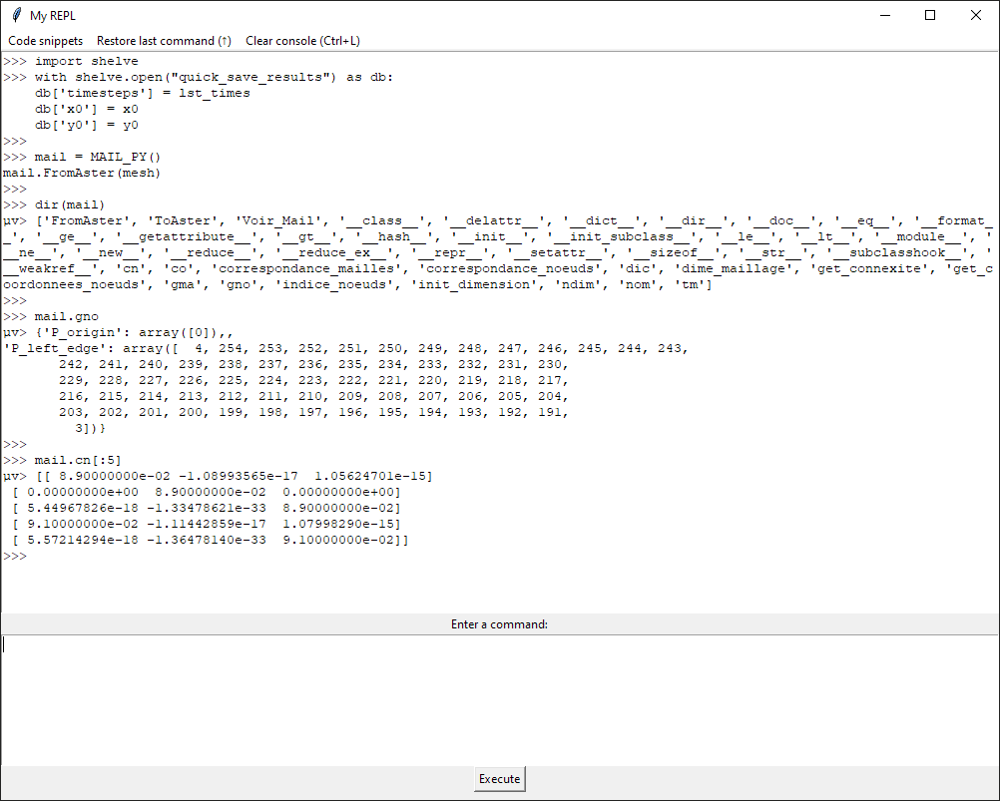

# A simple REPL for Code_Aster

> REPL : read-eval-print loop.



## Motivation

I created this REPL for using Code_Aster by EDF, but **it can be used in anything that understands Python code (and includes `tkinter`)**. This greatly reduced the learning curve of Code_Aster for me.

Although [Code_Aster](https://code-aster.org/spip.php?rubrique2) can be controlled using Python scripts, the `.comm` files cannot be run directly (one must use an `export` file) and it is enclosed in a virtual environments that makes interactive execution difficult.
Luckily, `tkinter` is included by default in Python and this lets us display a small interface to test code. The execution is paused until the REPL is closed.

## Installation

In order to access all variables in your `.comm` file, the function must be defined from inside the file.
I have found two ways to achieve this:
1. Copy-paste the content of `my_REPL.py` into your `.comm` file. This is straightforward, but clutters your code and makes maintenance harder when you have many studies.
2. At the beginning of your `.comm` file, use this code to "copy-paste" the function at runtime:
```py
with open("C:/path/to/my_REPL.py", encoding='utf-8') as f:
    entire_file = f.read()
exec(entire_file)
```
*If you know a better way, please contact me.*

## Usage

Examples:
```py
my_repl() # open the REPL
my_repl("# DEBUT") # open and execute a command (a comment in this case)
my_repl(["mail = MAIL_PY()", "mail.FromAster(mesh)"]) # run several commands after opening the REPL
my_repl("# We're inside a function", locals()) # access local scope
```

If the command was processed using...
* `eval`: `µv>` is printed before the result.
* `exec`: `µX>` is printed before the result. It rarely happens since most executed commands return `None`.
* and if an error occurred: `µ Error: `.

## Macros

The menu bar contains some useful snippets of code.

## Keyboard shortcuts
* `<Up>`: restore previous command
* `<Enter>`: execute command
* `Ctrl + L`: clear previous outputs

## Known issues / possible improvements

* If the REPL is open and the export file is called again, the execution ends with EXIT_CODE=4. Simply run the `export` file again and it will work.
* It is currently not possible to skip a line or move the cursor up while editing your commands.
* Sometimes `print` prints to the `as_run` log instead of the REPL. Or it doesn't print anything. Maybe I should overwrite the `print` function with `write_to_console`.
* No syntax highlighting.
* No autocompletion when pressing `<Tab>`.

## Acknowledgements

Thanks to [SimulEase](https://simulease.com/index.php/en/home/) for making Salome-Meca and Code_Aster available on Windows.


---

# Sublime Text 3 builder for `export` files
If you use the [Sublime Text](https://www.sublimetext.com/) text editor, this allows you to call `as_run` with the active `export` file by pressing Ctrl+B.
Simply put `Code_Aster_as_run.sublime-build` in your User folder ("Preferences > Browse Packages... > User") and edit the file to set the correct path to your `as_run.bat`.

`Code_Aster_as_run_COMM.sublime-build` will call the `export` file that has the same base name as the `*.comm` file you are building.